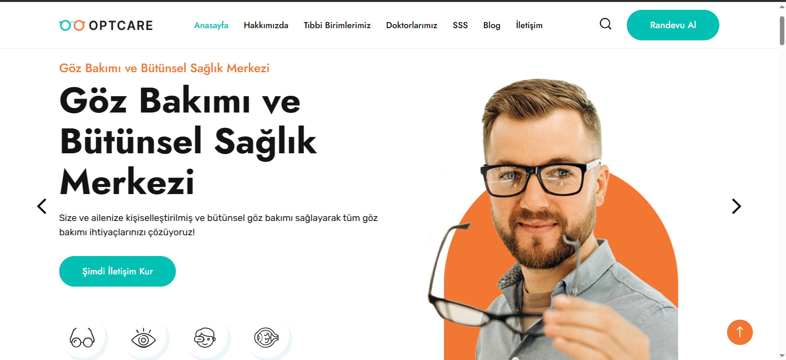

👁️ EyeCareAI - Yapay Zeka Destekli Göz Hastalıklarında Erken Teşhis Yapan Web Uygulaması

EyeCareAI, yapay zeka destekli algoritmalar kullanarak göz hastalıklarının erken teşhisini amaçlayan bir web tabanlı uygulamadır.  
Gelişmiş görüntü işleme ve makine öğrenmesi teknikleriyle göz taramalarını analiz eder, potansiyel hastalık belirtilerini tespit eder ve doktora ön değerlendirme sunar.  
Erken teşhis sayesinde tedavi sürecinin daha etkili hale gelmesine katkı sağlamayı hedefler.

---

## ⚙️ Kullanılan Teknolojiler

### 🖥️ Backend
- **ASP.NET Core** – Web API ve MVC yapısıyla güçlü ve ölçeklenebilir bir arka uç geliştirme
- **Entity Framework Core** – ORM (Object-Relational Mapping) aracı
- **MSSQL Server** – İlişkisel veri tabanı yönetim sistemi

### 🌐 Frontend
- **Razor Pages / MVC Views** – ASP.NET Core ile birlikte sunulan dinamik sayfa yapısı
- **HTML5, CSS3, JavaScript** – Temel frontend teknolojileri
- **Bootstrap** – UI bileşenleri ve responsive tasarım için

### 🧩 Diğer
- RESTful API yapısı
- Dependency Injection (bağımlılık enjeksiyonu)
- Model-View-Controller (MVC) mimarisi
- JSON ile veri alışverişi
- Swagger: API dokümantasyonu için

---

🚀 **Özellikler**

- ✅ **Görsel Tabanlı Göz Analizi**
  - Kullanıcılar göz görüntülerini sisteme yükler.
  - Yüklenen görüntüler yapay zeka tarafından analiz edilir.

- 🔍 **Yapay Zeka ile Erken Teşhis**
  - Eğitimli derin öğrenme modeli potansiyel göz hastalıklarını tanımlar.
  - Erken teşhis sayesinde doktora yönlendirme yapılabilir.

- 🧠 **Makine Öğrenmesi Altyapısı**
  - Görüntü sınıflandırması için CNN (Convolutional Neural Network) mimarisi.
  - Model, çeşitli veri kümeleriyle eğitilmiş ve optimize edilmiştir.

- 📊 **Detaylı Sonuç Ekranı**
  - Analiz sonuçları grafiklerle ve açıklamalarla gösterilir.
  - Hastalık ihtimali oranları kullanıcıya sunulur.

- 🌐 **Web Tabanlı Erişim**
  - Tüm modern tarayıcılardan erişilebilir responsive arayüz.
  - Mobil ve masaüstü uyumlu.

- 🛡️ **Gizlilik ve Güvenlik**
  - Kullanıcı verileri lokal veya güvenli veritabanlarında tutulur.
  - Görseller hiçbir şekilde üçüncü taraflarla paylaşılmaz.

---

📷 **Ekran Görüntüleri**

Aşağıda EyeCareAI web uygulamasına ait çeşitli ekran görüntülerini ve panellerin işleyişine dair açıklamaları bulabilirsiniz.

---

### 🏠 Ana Sayfa & Genel Site Arayüzü

### 🏠 Ana Sayfa & Genel Site Arayüzü

  
  
  
  
  
  
  
  
  
  
  

Ziyaretçilere yönelik hazırlanmış, modern ve kullanıcı dostu bir ana sayfa tasarımıdır.  
Kullanıcıları karşılayan tanıtım içerikleri, giriş yönlendirmeleri ve genel navigasyon bu bölümde yer alır.  

---

### 🧑‍⚕️ Doktor Paneli

- Yapay zeka tarafından analiz edilmiş hasta sonuçlarını görüntüler.
- Hastanın teşhis geçmişine erişim sağlar.
- Tedavi süreci hakkında not ekleme ve öneri belirtme fonksiyonları bulunur.

---

### 🧑‍💼 Admin Paneli

- Kullanıcı (doktor/hasta) yönetimi yapılır.
- Sistem ayarları, yetkilendirme ve log kayıtları görüntülenebilir.
- Yapay zeka model güncellemeleri ve sistem performans takibi bu alandan sağlanır.

---

### 🧑 Hasta Paneli

### 🧑‍🦰 Hasta Paneli

  

- Göz görüntüsü yükleme ve analiz başlatma alanı bulunur.
- Analiz geçmişi, teşhis sonuçları ve sistem önerileri kullanıcıya gösterilir.
- Gerekli durumlarda doktora ulaşma bağlantısı sağlanır.

---

